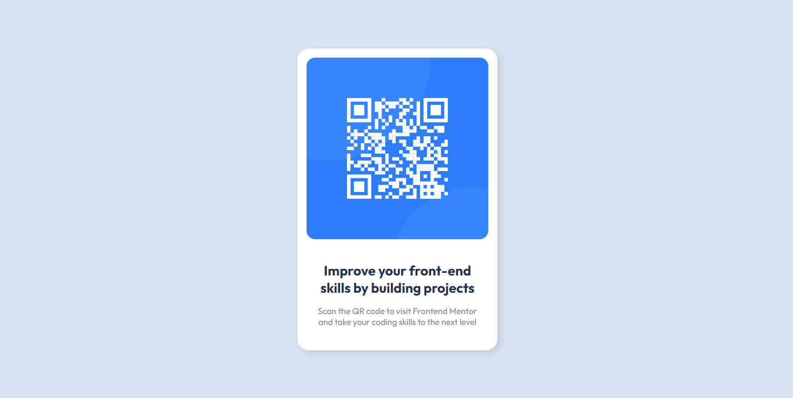

# Frontend Mentor - QR code component solution

This is a solution to the [QR code component challenge on Frontend Mentor](https://www.frontendmentor.io/challenges/qr-code-component-iux_sIO_H). Frontend Mentor challenges help you improve your coding skills by building realistic projects. 

## Screenshot

## Links
- Solution URL: [Frontend Mentor](https://www.frontendmentor.io/solutions/qr-code-component-using-css-flexbox-FLxUVjoRFy)
- Live Site URL: [GitHub Pages](https://nandanholla.github.io/qr-code-component)

## Built with 

- HTML5
- SCSS
- Flexbox

## Author

- Frontend Mentor - [@nandanholla](https://www.frontendmentor.io/profile/nandanholla)
- Twitter - [@nandanholla](https://www.twitter.com/nandanholla)
